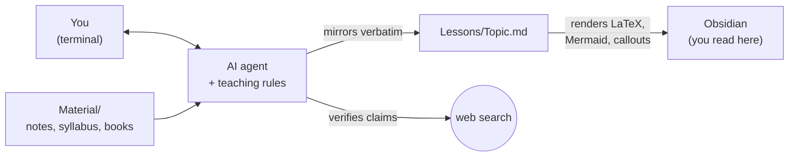

<h1 align="center">aula</h1>

<p align="center">
  <b>An Obsidian vault where a terminal AI agent teaches you —<br>
  and the lesson renders, live, as you read it.</b>
</p>

---

## The problem

Terminal coding agents turn out to be extraordinary tutors. They hold a whole
textbook in context, they never get bored of your third follow-up question, and
they can be told *how* to teach.

And then they print an integral as `\int_0^1 f(x) dx` into a scrolling terminal
buffer, and the lesson you needed to *read slowly* is gone the moment you resize
the window.

The terminal is a fine place to *talk* to a tutor. It is a terrible place to
*learn* from one.

## The idea

Don't render in the terminal. **Mirror the session into a markdown file and read
it in Obsidian**, where LaTeX and Mermaid render natively, with no plugins.

You type in the terminal. You read on the other half of the screen, typeset.



`aula` is the vault that makes this work: the folder layout, the agent
instructions, the safety rules that stop a mirrored log from eating your notes,
and a guide explaining the pedagogy you are signing up for.

## What makes it different from "just ask ChatGPT"

The agent is not asked to *explain a topic*. It is asked to follow a process.

| Phase | What happens | Why |
|---|---|---|
| **1 · Probe** | It quizzes you until it finds the **edge** of what you know — bounded from *both* sides: something at that level you get right, and something you get wrong. | You cannot teach into a zone of proximal development without knowing where its borders are. Getting everything right is not a pass; it means the questions were too easy. |
| **2 · Plan** | It sweeps the topic, then shows you a **dependency graph** with unconditional truths at the roots and your goal as the destination — **and stops for your approval.** | That map *is* the teaching order. A misplaced root is cheap to fix now and expensive to fix mid-lesson. |
| **3 · Teach** | It builds the graph **node by node**: motivate → establish → connect → quiz-check. A node that fails its check is repaired before anything is built on top of it. | Facts land when they are safe to commit to. Nothing is front-loaded and left unverified. |

Two principles run underneath all of it:

- **Unconditional truths first.** Start from statements you can accept at face
  value, with no caveats. Not because bottom-up is logically tidy, but because
  safe statements are the *easiest* to commit to, and they give you the first
  firm ground.
- **"How could I have discovered this myself?"** Every step is motivated — why
  this formula, why manipulate the equation *this* way. Facts feel arbitrary
  when you can see no reason they *had* to be that way, and brains don't commit
  to arbitrary information. The declared reference is 3Blue1Brown.

And one non-negotiable rule: **the moment the agent doubts a fact, a name, a
date, a formula or a definition, it stops and verifies it on the web before
saying it.** A single confidently-stated hallucination poisons your trust in
everything else — and a wrong root corrupts every node built on top of it.

> [!NOTE]
> The pedagogy is not mine. It comes from
> ([video](https://www.youtube.com/watch?v=kzcI5F4tGiU)), which encodes it as a
> skill for the `pi` agent. `aula` is the vault, the Obsidian bridge, the
> cross-agent adaptation layer and the documentation around it. See
> [Credits](#credits).

## What it looks like

The agent writes Obsidian callouts, so the log reads as a class, not as a
transcript. Tool calls are omitted entirely.

````markdown
> [!abstract] TUTOR
> Every probability we will ever write down is a number assigned to a **set**.
> That is unconditionally true, and worth pinning before anything else:
> $$P : \mathcal{F} \to [0,1]$$

> [!question] Quiz
> Two dice are rolled. Which statement is true of the sample space?
> 1. It has 36 elements, equally likely only if the dice are fair
> 2. It has 12 elements, one per possible sum
> 3. It has 11 elements, one per achievable sum
> 4. I don't know

> [!failure] Quiz — incorrect ✗
> Correct answer: **1**
> The sample space lists *outcomes*, not *values of a function of the outcome*.
> The sum is a random variable defined on top of it.
````

Rendered in Obsidian those become coloured boxes, real typeset math and — for
the Phase 2 plan — an actually drawn graph. See
[`docs/example-lesson.md`](docs/example-lesson.md) for a full worked session.

## Quick start

**Prerequisites:** [Obsidian](https://obsidian.md) · a supported agent (below) ·
`git`

```bash
git clone https://github.com/NouhKhouyi/aula
cd aula
```

Then install the teaching system and pick your agent:

```powershell
# Windows (PowerShell)
.\scripts\setup.ps1
```

```bash
# macOS / Linux
./scripts/setup.sh
```

Finally, in Obsidian: **Open folder as vault** → pick the `aula` folder.

The full walkthrough — first launch, authentication, the exact session flow and
the failure modes worth knowing — is in **[`docs/guide.md`](docs/guide.md)**.

## Supported agents

`aula` ships its instructions in [`AGENTS.md`](AGENTS.md), the cross-agent
convention, so most terminal agents pick them up with no configuration. What
differs is how much of the interactive machinery survives.

| Agent | Graded quizzes | Auto-mirrored log | Notes |
|---|:---:|:---:|---|
| **[pi](https://github.com/earendil-works/pi)** | ✅ native popup | ✅ `/md-log` | Reference path. Everything works. |
| **Claude Code** | ➖ in-chat | ✍️ agent-written | Quizzes render as callouts in the note; you answer in chat. |
| **Codex / Cursor / others** | ➖ in-chat | ✍️ agent-written | Anything that reads `AGENTS.md`. |

The degradation is deliberate and documented per agent in
[`docs/agents.md`](docs/agents.md). The pedagogy is the valuable part, and it is
plain prose that any capable model can follow.

## Repository layout

```text
aula/
├── AGENTS.md              # the instructions every agent reads. The core of this repo.
├── Lessons/               # one mirrored log per topic  (git-ignored: yours)
├── Material/              # your syllabus, notes, converted PDFs  (git-ignored: yours)
├── Templates/Lesson.md    # a correctly-empty lesson note
├── viz/                   # generated diagrams  (git-ignored)
├── docs/                  # the guide, the pedagogy, per-agent notes, FAQ
├── scripts/               # setup for Windows / macOS / Linux
└── .obsidian/             # a sane vault config, committed
```

> [!IMPORTANT]
> `Lessons/`, `Material/` and `viz/` are **git-ignored on purpose**. This
> repository *is* your vault: the moment you start studying, it fills with your
> own notes and your own copyrighted textbooks. Keep them local. If you fork
> `aula` to customise it, this is what stops you from publishing your lecture
> notes — and someone else's PDF — by accident.

## The rules that will save you

Learned the hard way; enforced by `AGENTS.md` and repeated in the guide.

1. **Link the log *before* you say anything to the agent.** Mirroring does a
   *backfill*: linking a file mid-session overwrites it whole with the session
   history. Link first, when there is no history, and nothing can be lost.
2. **Never edit a note while it is linked.** Every append rewrites the file.
   Put your own words in `Lessons/<Topic> - my notes.md` and wikilink it — and
   do write them, because rephrasing what you just understood is the best proof
   it landed connected instead of memorised.
3. **Use "I don't know."** It is a distinct signal, not a wrong answer. A lucky
   guess plants a false data point and steers the whole lesson off your real
   edge.
4. **Actually read the Phase 2 plan.** It is your checkpoint. Say so if a root
   does not look obviously true to you.

## Documentation

| | |
|---|---|
| [**The guide**](docs/guide.md) | Everything: install, first launch, session flow, the pedagogy in depth, command reference. Start here. |
| [**Your half of the system**](docs/pedagogy.md) | What *you* have to do, the four ways learners break it, and how to read a quiz. |
| [**Agents**](docs/agents.md) | Per-agent capabilities, and how to add support for a new one. |
| [**Windows & WSL2**](docs/windows.md) | Running without tmux or subagents, and the full-fidelity WSL2 route. |
| [**Working with material**](docs/material.md) | Feeding it your syllabus, your notes and your PDFs. |
| [**Example lesson**](docs/example-lesson.md) | What a rendered session actually looks like. |
| [**FAQ**](docs/faq.md) | Including "why not just a ChatGPT prompt?" |

## Contributing

Especially welcome: **support for another agent**, **translations of the
teaching layer**, and **reports of where the pedagogy broke down for you** —
that last one is the most valuable and the least likely to be filed. See
[CONTRIBUTING.md](CONTRIBUTING.md).

## Credits

- **[amosblomqvist/learn](https://github.com/amosblomqvist/learn)** — the
  teaching system itself: the `teach` and `visualize` skills and the `quiz`,
  `ask-user-question` and `md-log` extensions. `aula` installs it as an upstream
  clone and never vendors it. It carries no license, so all rights are reserved
  by its author; treat it accordingly.
- **[earendil-works/pi](https://github.com/earendil-works/pi)** — the agent the
  reference path runs on.
- **[Obsidian](https://obsidian.md)** — which renders LaTeX and Mermaid with no
  plugins, and is the reason any of this works.

## License

[MIT](LICENSE) — the vault, the adaptation layer and the documentation.
Upstream components keep their own terms.
